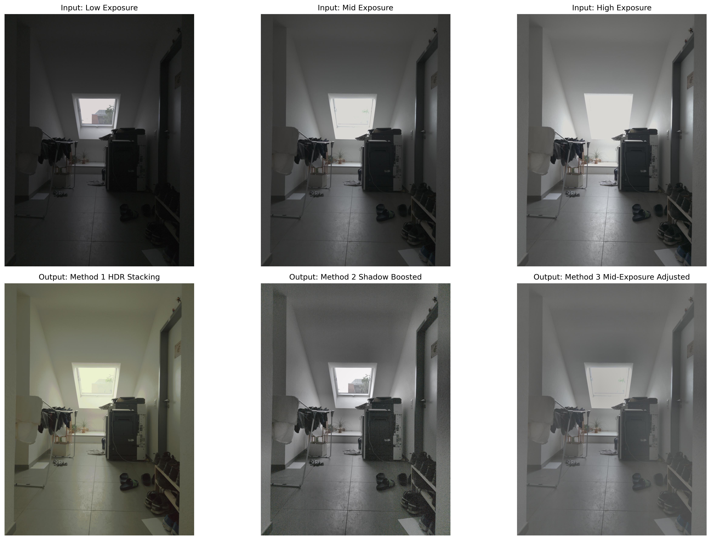

# Guide to Capturing HDR Images of Static and Dynamic Scenes

High Dynamic Range, or HDR, is an imaging technique used to represent scenes that contain both very bright and very dark regions. A normal camera image has a limited dynamic range, so when a scene contains strong contrast, such as a bright window inside a dark room, the camera often has to choose between preserving highlight detail or shadow detail.

In a standard low dynamic range image, bright regions may become saturated and appear completely white, while dark regions may become clipped and lose texture. HDR imaging solves this problem by capturing or reconstructing more brightness information than a single standard image can normally store.

A common HDR example might include:

- an underexposed image where the sky, lamp, or window is visible,
- a normally exposed image where midtones look natural,
- an overexposed image where shadows contain more detail,
- and a final HDR or tone-mapped result where both bright and dark areas are visible.

---

<div align="center">


<p><em>Example of an HDR-style before/after comparison.</em></p>


<p><em>Exposure bracketing captures information from both bright and dark regions.</em></p>


<p><em>Tone mapping compresses HDR data into a displayable image, making it possible to view the result on a normal screen while still preserving the visual impression of detail across shadows, midtones, and highlights.</em></p>

</div>

---

## Project Workflow

This project is organized around two main stages: first understanding the image data, and then applying HDR processing methods.

The input images in this repository were captured using Samsung S22 Expert RAW mode. Although these files have the `.dng` extension, they do not behave exactly like conventional camera RAW files from a DSLR or mirrorless camera. Smartphone RAW files, especially from computational photography modes such as Expert RAW, can contain Linear DNG data, TIFF-like structures, embedded previews, or already-processed image data. Because of this, it is not safe to assume that OpenCV or `rawpy` can load them directly as normal RGB images.

For that reason, the first notebook, [`dng_analysis.ipynb`](https://github.com/tijaz17skane/HowToCaptureHighDynamicInStaticAndDynamicScenes/blob/main/dng_analysis.ipynb), is used to inspect the image files. It checks what kind of data is stored inside the DNG files and tests different loading methods such as `rawpy`, OpenCV, and `tifffile`. This step is important because the quality of the HDR result depends heavily on how the input images are decoded and displayed.

After the DNG analysis, the project moves to the second notebook, [`hdr_methods.ipynb`](https://github.com/tijaz17skane/HowToCaptureHighDynamicInStaticAndDynamicScenes/blob/main/hdr_methods.ipynb). This notebook uses the loading strategy identified during the analysis step and applies three HDR-related methods. The first method performs true multi-exposure HDR stacking using the low, mid, and high exposure images. The second method uses only the low exposure image and boosts the shadows. The third method starts from the mid exposure image and adjusts highlights and shadows to create a more balanced result.

The main idea is to compare three practical approaches:

```text
1. Combine multiple exposures for true HDR.
2. Use a low exposure image to preserve highlights, then boost shadows.
3. Use a mid exposure image and adjust highlights/shadows for quick enhancement.
```

This separation keeps the repository clean. The README explains the motivation and workflow, `dng_analysis.ipynb` explains how the image data is interpreted, and `hdr_methods.ipynb` contains the actual HDR processing experiments.

---

## Repository Structure

```text
.
├── dng_analysis.ipynb
├── hdr_methods.ipynb
├── images/
│   ├── high_exposure.dng
│   ├── low_exposure.dng
│   └── mid_exposure.dng
├── outputs/
├── requirements.txt
└── utils.py
```

---

## 1. Capturing HDR Images for Static Scenes

For a static scene and a stationary camera, the most reliable way to create an HDR image is **exposure bracketing**. Exposure bracketing means capturing several images of the same scene from exactly the same camera position, but with different exposure times.

This is useful because no single exposure can capture every part of a high-contrast scene correctly. A short exposure protects bright regions from becoming fully white, while a long exposure reveals details hidden in the shadows. By combining these images, we can create a final result that contains more detail across the full brightness range of the scene.

For example, consider an indoor scene with a bright window. If the camera exposes for the room, the window may become completely white. If the camera exposes for the window, the room may become too dark. HDR imaging solves this by capturing both exposures and combining their useful information.

The basic idea is:

```text
Short exposure  → preserves highlights
Medium exposure → preserves midtones
Long exposure   → preserves shadows

Combined result → better detail across highlights, midtones, and shadows
```

Because the scene is static, the content does not change between shots. Because the camera is stationary, each pixel location should correspond to the same point in the scene across all exposures. This makes static-scene HDR much easier than HDR for dynamic scenes.

---

## 2. Recommended Capture Setup

The most important rule is:

```text
Only change the shutter speed.
```

The following settings should remain fixed:

```text
Camera position: fixed
Focus: manual and fixed
White balance: fixed
ISO: fixed
Aperture: fixed
Shutter speed: varied
Image format: RAW preferred
```

Changing the shutter speed changes exposure without changing the optical properties of the image. This is ideal for HDR.

Changing aperture is not recommended because it changes the depth of field. Changing ISO is also not ideal because it changes the noise characteristics of the image. Changing focus should also be avoided because it changes the sharpness and geometry of the image.

A good exposure bracket should satisfy the following:

```text
The darkest image has visible highlight detail.
The brightest image has visible shadow detail.
The middle image has natural-looking midtones.
The scene does not move between images.
The camera does not move between images.
```

If the brightest parts of the scene are white in every image, the highlights are clipped and cannot be recovered. If the darkest parts of the scene are black in every image, the shadows contain no useful information and cannot be recovered.

HDR can combine captured information, but it cannot recover information that was never recorded.

---

## 3. Input Images

The input images used in this repository were captured using **Samsung S22 Expert RAW** mode at three different exposure levels:

```text
images/
├── low_exposure.dng
├── mid_exposure.dng
└── high_exposure.dng
```

Conceptually:

```text
low_exposure.dng   → protects highlights
mid_exposure.dng   → captures midtones
high_exposure.dng  → reveals shadows
```

---

## 4. Loading RAW `.dng` Images

Different cameras and phones can store very different kinds of data inside `.dng` files. A DNG file may contain conventional Bayer RAW data, Linear DNG data, TIFF-like image data, embedded previews, or computationally processed image data. Because of this, the correct loading strategy should be determined before HDR processing begins.

For this project, the DNG loading analysis is handled in the notebook below:

[`dng_analysis.ipynb`](https://github.com/tijaz17skane/HowToCaptureHighDynamicInStaticAndDynamicScenes/blob/main/dng_analysis.ipynb)

Please follow the guidelines in that notebook to determine what type of RAW/DNG image data is available and which loading method should be used. The notebook checks the files using `rawpy`, OpenCV, and `tifffile`, then explains why the final HDR workflow uses a `tifffile`-based loading approach for these Samsung Expert RAW images.

---

## 5. Step-by-Step HDR Stacking Using OpenCV

The step-by-step HDR processing implementation is provided in the main methods notebook:

[`hdr_methods.ipynb`](https://github.com/tijaz17skane/HowToCaptureHighDynamicInStaticAndDynamicScenes/blob/main/hdr_methods.ipynb)

Please follow this notebook for the complete OpenCV workflow. It loads the images using the strategy identified in `dng_analysis.ipynb`, applies the HDR and enhancement methods, displays intermediate results, and saves the final outputs.

The notebook covers three methods:

```text
Method 1: True HDR by exposure stacking
Method 2: Shadow boosting from the low exposure image
Method 3: Highlight and shadow adjustment from the mid exposure image
```

---

### Method 1: True HDR by Exposure Stacking

This method uses the low, mid, and high exposure images together.

```text
low exposure  → preserves highlights
mid exposure  → preserves midtones
high exposure → reveals shadows
```

The images are approximately rendered from DNG, aligned, merged into an HDR radiance map, and tone-mapped for display using OpenCV.

This is the main HDR method for static scenes.

---

### Method 2: Shadow Boosting from the Low Exposure Image

This method uses only the low exposure image.

It is not true HDR because it does not combine multiple exposure captures. However, it is useful when highlight preservation is important. The low exposure protects bright regions from clipping, and the shadows are then digitally boosted.

This method is useful when:

```text
only one exposure is available
highlight clipping must be avoided
motion makes multi-exposure stacking difficult
```

---

### Method 3: Highlight and Shadow Adjustment from the Mid Exposure Image

This method uses only the mid exposure image.

It reduces highlights, boosts shadows, and improves local contrast. This is also not true HDR, but it is useful as a single-image enhancement method.

This method is useful when:

```text
a normal exposure is already available
quick visual improvement is needed
no exposure bracket is available
```

---

## 6. Outputs

Generated results are saved in the `outputs/` folder when `hdr_methods.ipynb` is run.

Typical outputs include:

<div align="center">



<p><em>Top row: low, mid, and high exposure inputs. Bottom row: HDR stacking, shadow boosting, and mid-exposure adjustment results.</em></p>

</div>

---

## 7. Installation

Create and activate a virtual environment, then install the required packages:

```bash
pip install -r requirements.txt
```

The main dependencies are:

```text
opencv-python
numpy
matplotlib
tifffile
imagecodecs
```

---

## 8. Running the Project

Run the notebooks in this order:

1. Open and run [`dng_analysis.ipynb`](https://github.com/tijaz17skane/HowToCaptureHighDynamicInStaticAndDynamicScenes/blob/main/dng_analysis.ipynb)
2. Open and run [`hdr_methods.ipynb`](https://github.com/tijaz17skane/HowToCaptureHighDynamicInStaticAndDynamicScenes/blob/main/hdr_methods.ipynb)

The first notebook explains how the `.dng` files are structured and why a `tifffile`-based loader is used.

The second notebook applies the three HDR-related processing methods and saves the results in the `outputs/` folder.

---

## 9. Notes on Samsung Expert RAW

Samsung Expert RAW `.dng` files may not behave like conventional camera RAW files. They can contain computational or Linear DNG data rather than simple Bayer RAW data.

Because of this, directly loading the `.dng` files with OpenCV or `rawpy` may fail or produce poor-looking images. In this project, `tifffile` is used to read the DNG image arrays, and an approximate rendering step is applied before OpenCV processing.

For a production-grade imaging pipeline, the DNG files could also be exported as 16-bit TIFF files using a RAW-aware application such as Lightroom, Adobe Camera Raw, or Samsung tools before being processed with OpenCV.

---

## 10. HDR for Dynamic Scenes

Dynamic scenes are more difficult than static scenes because objects may move between exposures. Examples include:

```text
people walking
cars moving
trees moving in wind
water waves
rain
changing lights
handheld camera motion
```

In a static HDR pipeline, the algorithm assumes that the same pixel location corresponds to the same scene point in every exposure. Motion breaks this assumption.

This can create artifacts such as:

```text
ghosting
double edges
blurred moving objects
incorrect colors around motion boundaries
misaligned object edges
```

For dynamic scenes, there are three practical options:

```text
1. Use single-frame enhancement.
2. Use exposure fusion if motion is small.
3. Use hardware or computational HDR capture.
```

For strongly dynamic scenes, a single image is often safer than multi-exposure HDR. This avoids ghosting because there is only one frame.

For scenes with slight motion, exposure fusion may produce a usable result, but it should always be checked carefully for ghosting.

For truly dynamic scenes, the best solution is often hardware-based HDR or single-shot HDR using high dynamic range sensors, dual-gain sensors, log video profiles, RAW video, or computational HDR pipelines.

---

## 11. Method Comparison

| Method | Input Required | True HDR? | Best For | Main Advantage | Main Limitation |
|---|---:|---:|---|---|---|
| Exposure stacking | Multiple exposures | Yes | Static scenes | Best highlight and shadow recovery | Requires static scene and stationary camera |
| Shadow boosting from low exposure | One low exposure image | No | Preserving highlights | Avoids clipped highlights and motion artifacts | Shadows may become noisy |
| Mid-exposure adjustment | One mid exposure image | No | Quick visual improvement | Simple and convenient | Cannot recover clipped highlights or black shadows |

---

## 12. Conclusion

HDR imaging is most reliable when the camera is stationary and the scene is static. In this setup, multiple exposures can be captured and merged to recover detail from both shadows and highlights.

The best technical method is true HDR exposure stacking. This combines low, mid, and high exposure images into an HDR radiance map, which can then be tone-mapped for display.

Single-image methods such as shadow boosting or mid-exposure adjustment can improve the appearance of an image, but they are not true HDR. They are useful when only one image is available or when motion makes exposure stacking unreliable.

In summary:

```text
Best overall HDR quality:
    Multi-exposure HDR stacking

Best single-image highlight protection:
    Underexpose and boost shadows

Best quick visual improvement:
    Adjust highlights and shadows in a mid-exposed image

Best for dynamic scenes:
    Single-frame enhancement or hardware HDR
```

---

## Main Notebooks

- [`dng_analysis.ipynb`](https://github.com/tijaz17skane/HowToCaptureHighDynamicInStaticAndDynamicScenes/blob/main/dng_analysis.ipynb): investigates how the Samsung Expert RAW `.dng` files can be read.
- [`hdr_methods.ipynb`](https://github.com/tijaz17skane/HowToCaptureHighDynamicInStaticAndDynamicScenes/blob/main/hdr_methods.ipynb): applies the three HDR-related processing methods using OpenCV.
